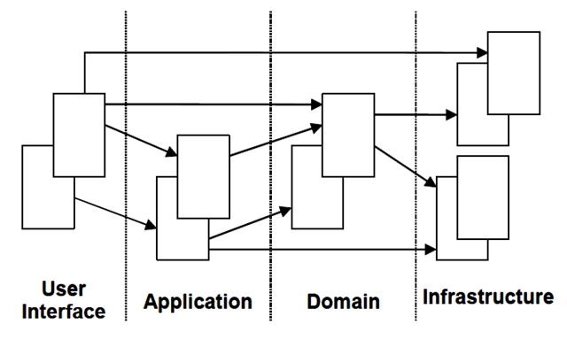

# 领域驱动设计基础概念

DDD是Domain driven design（领域驱动设计）的简称，是一种软件设计和开发的方法论，特别适用于复杂业务领域软件设计和开发。

## 基本概念

### Bounded context：限界上下文

划分领域边界，边界内领域模型保持一致，强调内聚，并与边界外的领域模型解耦。

### Entity：领域实体

有唯一标识，可变的业务实体对象，它有着自己的生命周期。比如User、帖子等。

### Value Object：领域值对象

没有唯一业务标识，通常依附于其他领域实体，值对象的内容不可变，要么被整体替换。

### Aggregate：聚合

是一组业务关联度很强的实体/值对象集合，每个聚合都有一个根实体（Root Entity），通过根实体可以路由到整个聚合。

### Domain Event：领域事件

领域中发生的异步处理事件、异步消息通知等，比如：异步写入的登录历史记录。通常借助消息队列实现。

### Domain Service：领域服务

当某些业务行为无法归类到某一个Entity/Value Object时，我们便可以创建领域服务来完成。比如：账户转账场景，涉及到两个不同的Account实体，再比如社区的敏感词过滤场景，帖子可以用，评论亦可以用，因此可以抽离到ContentFilter中完成。

### Repository：仓库

严格意义上将仓库是基础设施层的东西，但是为了保持领域模型的整体性，我们将仓库的接口定义放到领域中，这样可以在领域中约束实体/值对象的增删改查接口，同时还可以方便地完成仓库的内存形式实现，使得领域模型弱依赖于持久化层。这一点在书中被成为‘依赖倒置’（参考《实现领域驱动设计》P372）

## 领域驱动设计的经典分层架构

### 用户界面层

用户接口层，对外以各种协议提供服务，该层需要明确定义支持的服务协议、契约等。
负责向用户展现信息以及解释用户命令。更细的方面来讲就是：
- 请求应用层以获取用户所需要展现的数据；
- 发送命令给应用层要求其执行某个用户命令；

### 应用服务层

应用层定义系统的业务功能，并指挥领域层中的领域对象实现这些功能。应用层映射到系统用例模型，是系统用例模型在软件中的反映。
应用层实现类不实现业务逻辑，它通过排列组合领域层的领域对象来实现用例，它的职责可表示为“编排和转发”，即将它要实现的功能委托给一个或多个领域对象来实现，它本身只负责安排工作顺序和拼装操作结果。对外为展现层提供各种应用功能（包括查询或命令），对内调用领域层（领域对象或领域服务）完成各种业务逻辑，应用层不包含业务逻辑。

### 业务领域层

业务领域层，负责表达业务概念，业务状态信息以及业务规则，领域模型处于这一层，是业务软件的核心，需要保证这一层是高内聚的。确保所有的业务逻辑都留在这一层，而不会遗漏到其他层。

### 基础设施层

基础设施层是系统中的技术密集部分。它为领域层（依赖领域层：提供持久化的实现）、应用层的业务服务（消息通信等等）提供具体的技术支持，用户接口层通常使用特定的表示层框架（例如SpringMVC）实现，同时会存在message、redis等服务调用可通过Infrastructure层来完成。总之，基础设施层可以通过架构和框架来支持其他层的技术需求。
