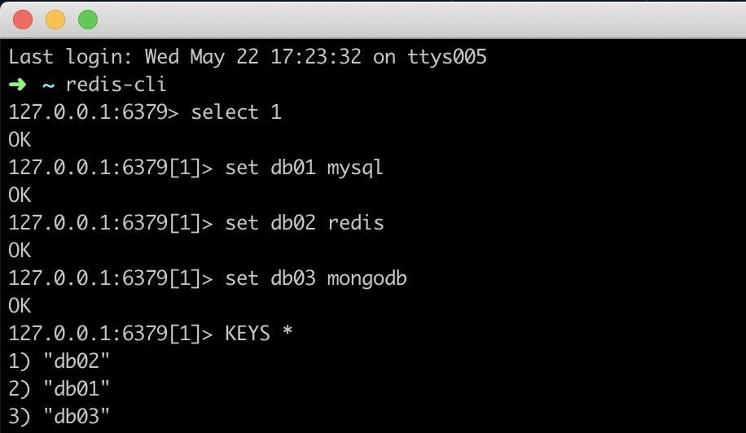
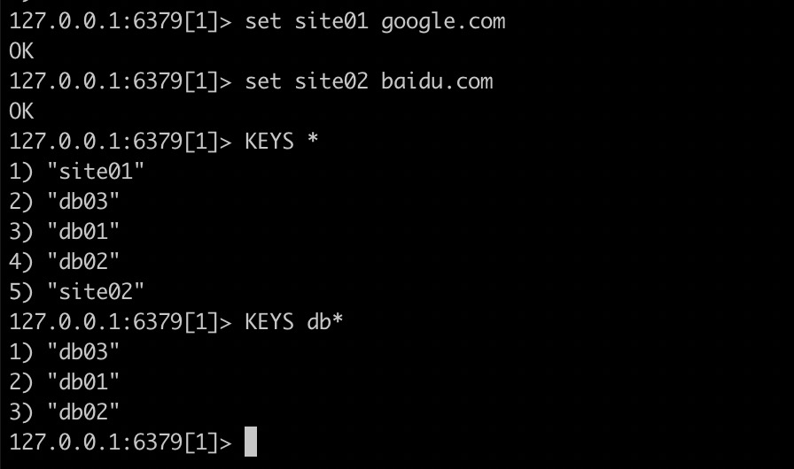
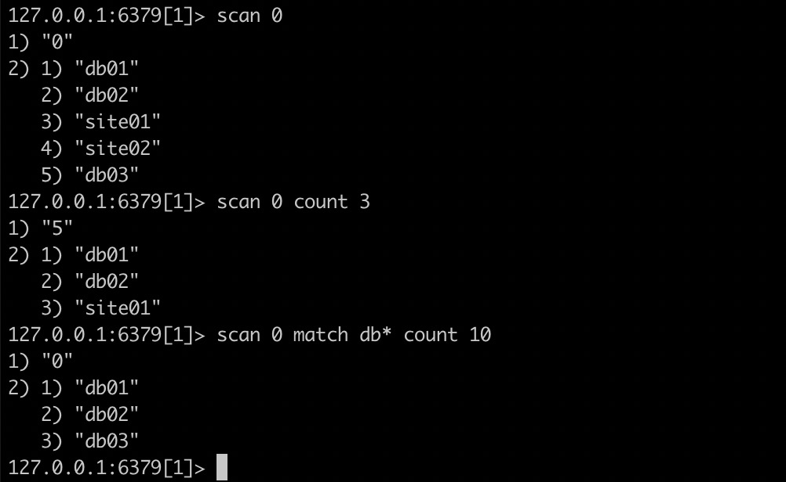

# Redis使用SCAN代替KEYS命令

在最近的一次抽奖功能开发过程中，为了支撑高并发的场景引入了 Redis 中间件。Redis 的读写性能可达到每秒10万次，非常诱人。今天主要讲述开发过程中使用的两个 Redis 命令 KEYS、SCAN 以及使用过程中遇到的坑，抽奖活动的介绍后面将另开篇幅描述。

## KEYS命令

KEYS 命令用于查找所有符合给定模式 pattern 的 keys。

基本语法为：KEYS pattern

### 举个栗子

- 查询所有键使用 KEYS *



- 查询以db为前缀的键使用 KEYS db*



### 踩坑

KEYS 命令会一次性扫描所有记录（类似 SQL 中的 select * 语句），会将 Redis 中所有的 key 与 pattern 参数一一匹配。当 Redis 中 key 数量越大时，KEYS 命令执行越慢。该命令对服务器性能有很大的损耗，最重要的会是**阻塞服务器**（可能长达数秒之久）。因此在生产环境中应该禁止使用KEYS 命令。

好在 Redis2.8 版本以后官方给我们提供了一个更好的遍历 KEY 的命令 SCAN。

## SCAN命令

与 KEYS 命令不同，SCAN 是将所有 key 分页处理。每次处理的条数通过参数传入，处理后返回一个游标和一个 key 集合，下次再次请求的时候携带该游标继续遍历。该命令对数据库的性能影响比较小，因此推荐在生产环境中使用。

基本语法为：SCAN cursor [MATCH pattern] [COUNT count]

### 举个栗子



### 相关命令

- SSCAN 用于迭代集合键中的元素
- HSCAN 用于迭代哈希键中的键值对
- ZSCAN 用于迭代有序集合中的元素

### 踩坑

SCAN 命令中的 COUNT 参数表示返回多少个元素。但是由于匹配的过程是在遍历 key 之后返回结果之前，因此迭代的结果会出现某一页返回空集合或者元素个数小于 count，继续迭代又返回非空集合的情形。若要用 SCAN 替代 KEYS 命令，需要将游标迭代至0。

## SCAN替代KEYS命令

```java
public Set<String> scanKeys(String pattern) {
    Set<String> result = Sets.newHashSet();
    try {
        ScanParams scanParams = new ScanParams();
        // key的正则表达式
        scanParams.match(pattern);
        // 每次扫描多少条记录，值越大消耗的时间越短，但会影响redis性能。建议设为一千到一万
        scanParams.count(1000);
        String cursor = "0";
        do {
            String finalCursor = cursor;
            ScanResult<String> keys = jedisTemplate.execute(jedis -> {
                return jedis.scan(finalCursor, scanParams);
            });
            result.addAll(keys.getResult());
            cursor = keys.getStringCursor();
        } while (!"0".equals(cursor));
        log.info("scan keys result:{}", result);
    } catch (Exception e) {
        log.error("failed to scan pattern:{}, cause:{}", pattern, Throwables.getStackTraceAsString(e));
    }
    return result;
}
```
